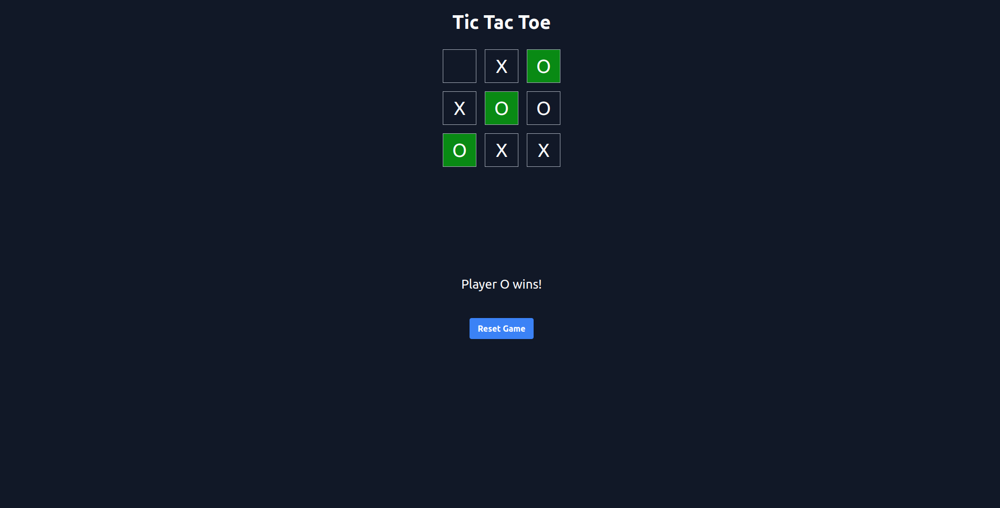

# Tic Tac Toe Game

This is a simple Tic Tac Toe game built with React. It allows two players to take turns marking X and O on a 3x3 grid. The first player to get three of their marks in a row (horizontally, vertically, or diagonally) wins the game. If all cells are filled and no winner is found, the game ends in a draw.

## Features

- Interactive gameplay with alternating turns between two players.
- Visual indication of the winning combination when a player wins.
- Animated messages for game outcomes (player wins or draw).
- Reset button to start a new game.
- Cool animations and transitions to enhance the user experience.

## screenshot



## Technologies Used

- React: JavaScript library for building user interfaces.
- TypeScript: Superset of JavaScript that adds static typing to the language.
- HTML/CSS: Markup and styling for the game board and components.
- JavaScript: Programming language used to implement game logic and interactions.
  .

## Installation

To run the Tic Tac Toe game locally on your machine, follow these steps:

1. Make sure you have Node.js installed on your computer.
2. Clone this repository to your local machine using Git or download the ZIP file.
3. Navigate to the project directory in your terminal or command prompt.
4. Run the following command to install the project dependencies:

```bash
npm install
```

5. Once the installation is complete, start the development server with the following command:

```bash
npm start
```

6. Navigate to <http://localhost:3000> in your browser to run the game.

## How to Play

1. The game starts with Player X as the first player.
2. Click on an empty cell on the game board to place your mark (X or O).
3. Players take turns marking empty cells until a winning combination is achieved or the game ends in a draw.
4. If a player wins, a message will be displayed indicating the winner.
5. To start a new game, click the "Reset Game" button.

Enjoy playing Tic Tac Toe!

moahammadabbsi378@gmail.com
